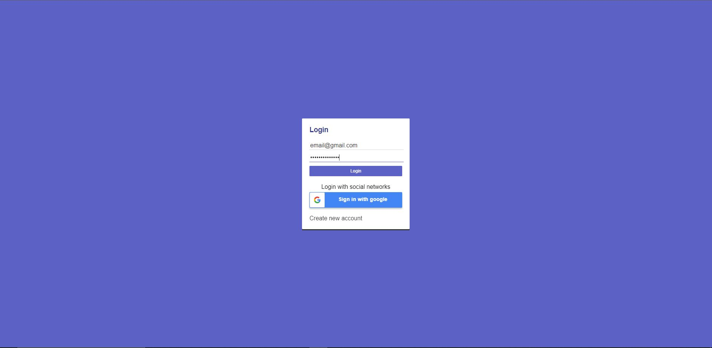
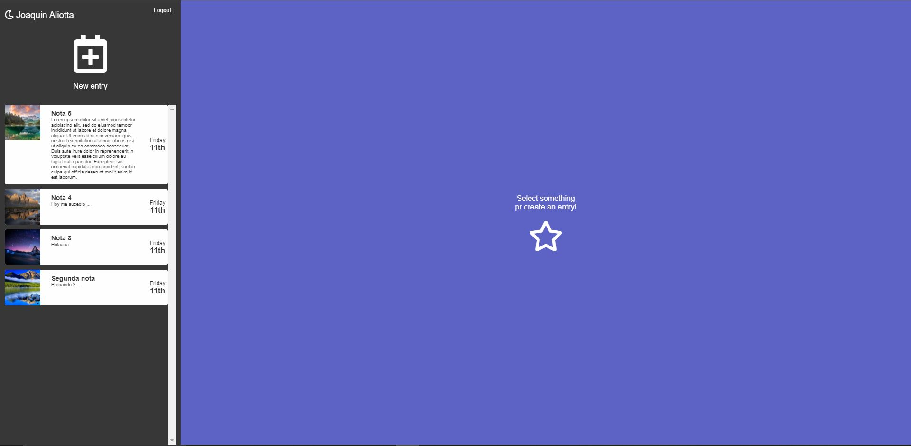
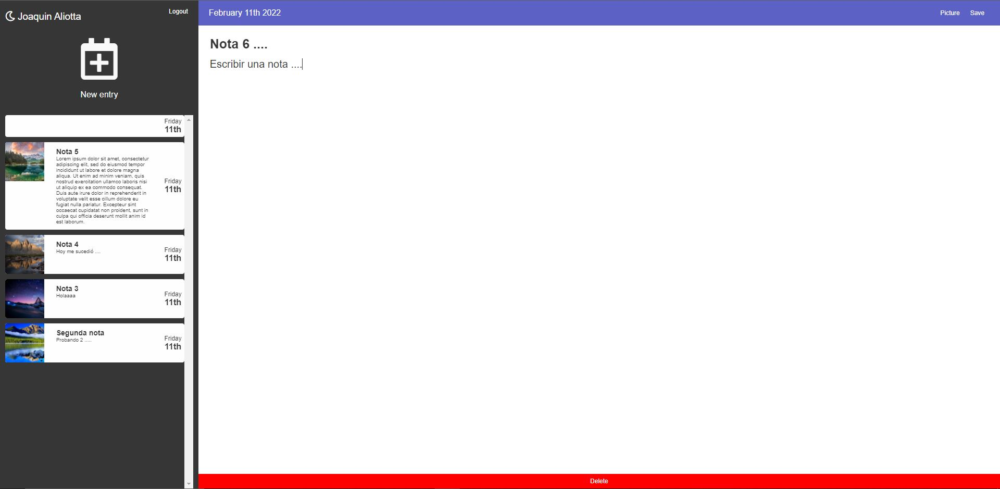
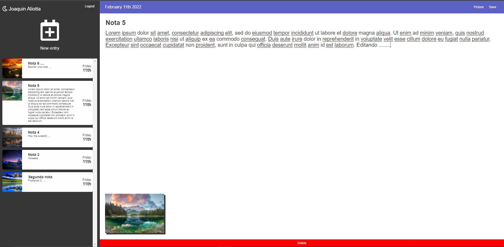

# journal-app

Aplicación para registro de sucesos de la vida. Permite registrar notas indicando fecha, título, un texto y una foto, persistiendo los datos ingresados en Firestore y las imagenes en la nube de Claudinary. Tiene autenticación de usuario, tanto con email y password, como con cuenta de Google.

Incluye:

* Redux
* Acciones asíncronas con Thunk
* SASS
* Firestore
* Autenticación con email y password, y con cuenta de Google
* Claudinary para guardar imágenes en la nube
* Alertas de sweetalert2
* Fontawesome para iconos
* Animaciones de Animate.css

## Demo 🔗

[ONLINE VERSION]()

## Uso de la demo online

1. Registro con email y contraseña. O bien realizar ingreso con cuenta de gmail en paso 2.


2. Login con email y contraseña, o cuenta de gmail.



3. Pantalla principal. Agregar nueva nota haciendo click en "New entry". 



4. Click en "Save" para guardar nota. También se puede cargar una imagen haciendo click en "Picture". Luego de subida la imagen, se guarda automáticamente la nota.



5. Click sobre una nota para editarla. También se puede borrar la nota con el botón "Delete" rojo que se encuentra en la parte inferior de la pantalla.



## Tecnologías utilizadas 🛠️

Este proyecto fue inicializado con [Create React App](https://github.com/facebook/create-react-app).

- HTML5
- CSS
- SASS
- React.js
- Firestore

## Instalación local 🔧

1. Clonar repositorio
    ```bash
    git clone
    ```
2. Instalar el proyecto
    ```bash
    npm install
    ```
3. Correr
    ```bash
    npm start
    ```

